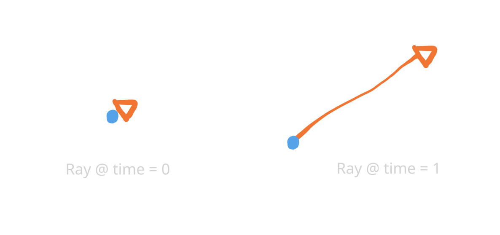
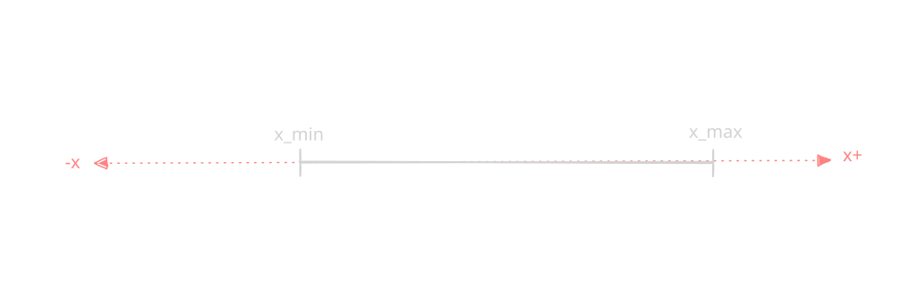
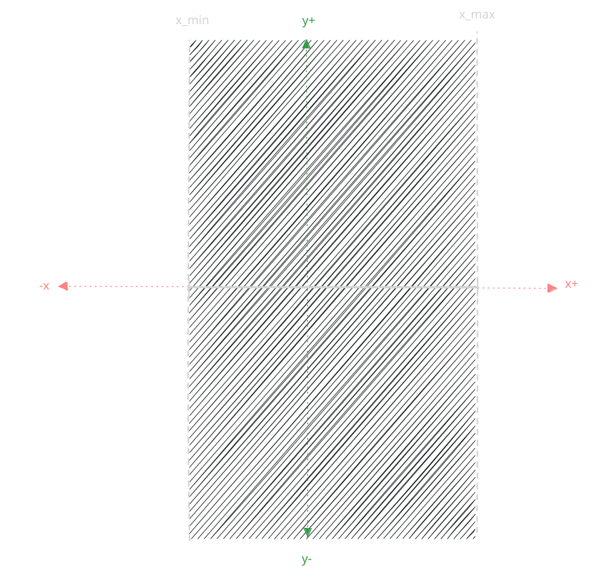
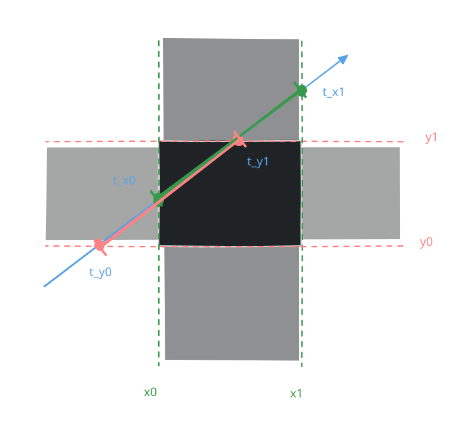
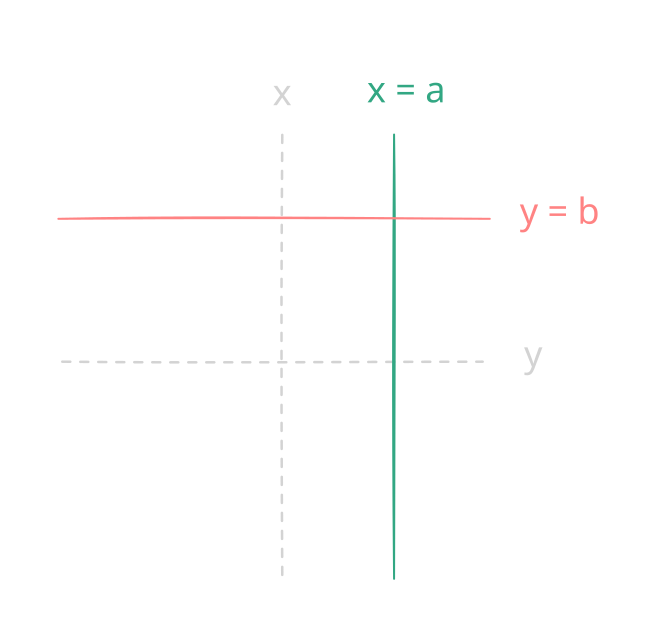

# AABB Ray Casting

Useful for collisions and rendering.

## Demo

**Click here for a [Interactive Demo](./slab_method.html)**

## Notes
- I was going to use this for Wolfenstein 3D's rendering until I realised I could use something less intensive.
    - By the time I figured it out I already too deep into the demo I might as well finish it `¯\_(ツ)_/¯`.
- Walkthrough assumes you can do basic algebra.
- Before any mathematicians comment about not using the right terminology: (〜￣▽￣)〜 *oh no* 〜(￣▽￣〜).

## Walkthrough

### 1. Rays
A ray is an imaginary line draw starting at a position (origin), which travels along a direction (sometimes with a set distance).


This can be written as:

$$\vec{O} + \vec{D}$$

---



The position of a ray over time is can be written as:

$$\vec{P}(t) = \vec{O} + t \cdot \vec{D}$$

Or when view as their 2D components:
$$\vec{P_x}(t) = \vec{O_x} + t \cdot \vec{D_x}$$
$$\vec{P_y}(t) = \vec{O_y} + t \cdot \vec{D_y}$$

### 2. Slabs

A slab is a 1D region defined by a minimum and maxmimum on said dimension/axis:

For example in the x-axis:
$$\text{Slab}_x: x_{\min} \le x \le x_{\max}$$

A slab when viewed in 1D:


A slab when viewed in 2D:


### 3. Axis-Aligned Bounding Box

An axis-aligned bounding box (AABB) is a box made of multiple slabs:


### 4. Cutting boxes with rays
#### 4.1 How to detect a hit

> A ray passes through an AABB in all dimensions when:
> - For each dimension (axis), there is a slab defined by an AABB in said axis,
> - If the ray overlaps with (or begins in) said slab for a range of the parametric variable $t$,
> - Such that there exists **a shared range of $t$ for all dimensions**.
---

Further reading: Ray tracing complex scenes - Chapter 2.3: Ray-Volume Intersections *(Timothy L. Kay and James T. Kajiya. 1986. Ray tracing complex scenes. SIGGRAPH Comput. Graph. 20, 4 (Aug. 1986), 269–278. https://doi.org/10.1145/15886.15916)*

#### 4.2 Examples and Demos


---

An example of a hit:



An example of a miss:


#### 4.3 Special Rays

A special case of the above is when the ray is also axis-aligned. This will be when $D_y = 0$ and $D_x = 0$ for an vertical and horizontal ray respectivly.  
$$\vec{D_x} = 0 \quad \text{or} \quad \vec{D_y} = 0$$

#### 4.4 How do we find $t$?

Assuming that we only collide with vertical or horizontal lines (remember: AABB) which can be defined as:

$$x=a$$
$$y=b$$



We can make some assumptions to make raycasting easier.

---

For now we will work on the x axis only.

The point of intersection between a ray and the x-axis is (with an unknown $t$):


$$ \vec{P_x}(t) = a $$

To solve for t:

$$ \vec{P_x}(t) = \vec{O_x} + t \cdot \vec{D_x} = a $$
$$ t = \frac{a - \vec{O_x}}{\vec{D_x}} $$

We know that if for any $t$ if the above can be solved, then the ray will intersect the line at $x=a$.

#### 4.5 Pseudocode

Just in case you need it.

```c
// Intersect ray R(t) = p + t*d against AABB a. When intersecting,
// return intersection distance tmin and point q of intersection
int IntersectRayAABB(Point p, Vector d, AABB a, float &tmin, Point &q)
{
    tmin = 0.0f; // set to -FLT_MAX to get first hit on line
    float tmax = FLT_MAX; // set to max distance ray can travel (for segment)
    
    // For all three slabs
    for (int i = 0; i < 3; i++) {
        if (Abs(d[i]) < EPSILON) {
            // Ray is parallel to slab. No hit if origin not within slab
            if (p[i] < a.min[i] || p[i] > a.max[i]) return 0;
            } else {
                // Compute intersection t value of ray with near and far plane of slab
            float ood = 1.0f / d[i];
            float t1 = (a.min[i] - p[i]) * ood;
            float t2 = (a.max[i] - p[i]) * ood;
            // Make t1 be intersection with near plane, t2 with far plane
            if (t1 > t2) Swap(t1, t2);
            // Compute the intersection of slab intersection intervals
            if (t1 > tmin) tmin = t1;
            if (t2 < tmax) tmax = t2;
            // Exit with no collision as soon as slab intersection becomes empty
            if (tmin > tmax) return 0;
        }
    }
    // Ray intersects all 3 slabs. Return point (q) and intersection t value (tmin)
    q = p + d * tmin;
    return 1;
}
```
Adapted and corrected from: [Real-Time Collision Detection - 5.3 Intersecting Lines, Rays, and (Directed) Segments - Page 180](http://www.r-5.org/files/books/computers/algo-list/realtime-3d/Christer_Ericson-Real-Time_Collision_Detection-EN.pdf) (Corrected `if (t2 > tmax) tmax = t2;` to `if (t2 < tmax) tmax = t2;`)