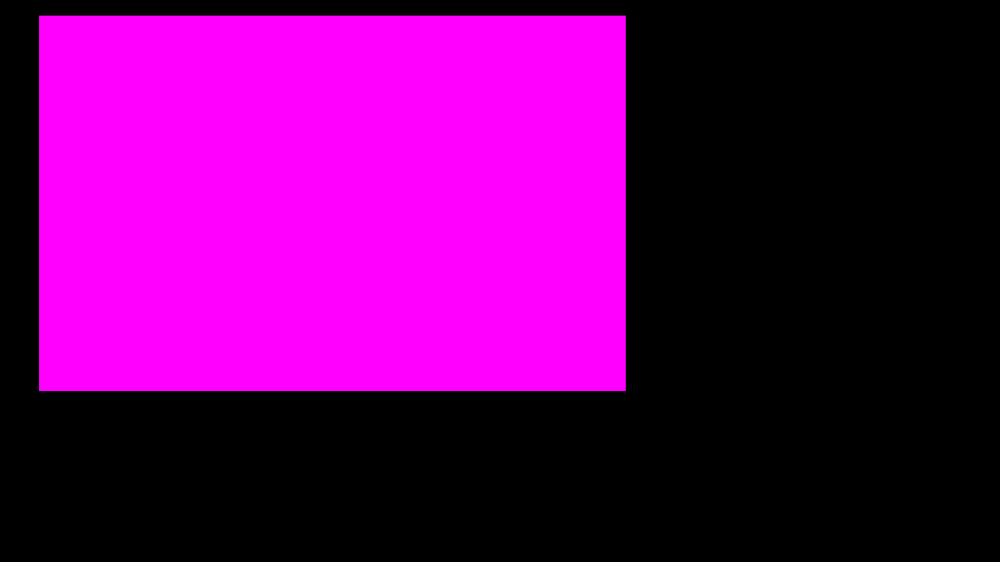
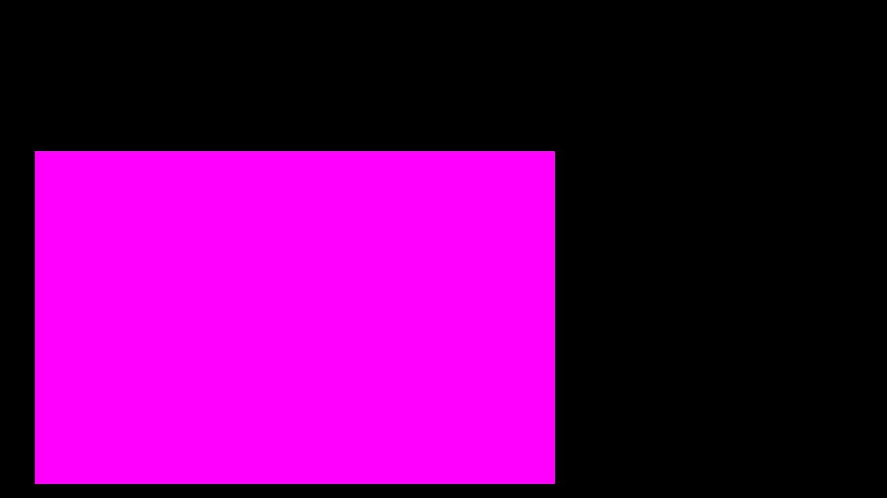

# 1.0 Setup

> [Demo](./wolfenstein-3d.html)

## 1.1 The "Engine" 
The first order of business is create the tick/update cycles. This is copied from an earlier project, but with support for the render and physics ticks to be on seperate frames (i.e. when the physics is locked to a certain tick rate)

```js
const draw = (delta, viewport) => {

}

const tick_rate = 60;
const render_fps = null;

let physics_last_frame = performance.now();
let render_last_frame = performance.now();
let physics_delta = 0;
let render_delta = 0;

const tick = (delta) => {

}


const viewport = setup_viewport();
viewport.set_resolution(1280, 720);

const update = () => {
    const current_frame = performance.now();

    physics_delta = (current_frame - physics_last_frame) / 1000;
    if (tick_rate == null || physics_delta >= 1 / tick_rate) {
        tick(physics_delta);
        physics_last_frame = current_frame;
    }

    render_delta = (current_frame - render_last_frame) / 1000;
    if (render_fps == null || render_delta >= 1 / render_fps) {
        draw(render_delta, viewport);
        viewport.render()
        render_last_frame = current_frame;
    }

    requestAnimationFrame(() => update(viewport));
};

requestAnimationFrame(() => update());
```

Next will be to create the viewport throught which the virtual world should be rendered. This will be done by drawing individual pixels to a frame buffer each render frame (as opposed to before where I have somewhat cheated by drawing using the `SVG`-like functions of a `canvas`).

```js
const DEFAULT_VIEWPORT_W = 400;
const DEFAULT_VIEWPORT_H = 300;
const setup_viewport = () => {
    const canvas = document.getElementById("viewport");
    const ctx = canvas.getContext("2d");

    let viewport_w = DEFAULT_VIEWPORT_W;
    const get_viewport_w = () => viewport_w;
    let viewport_h = DEFAULT_VIEWPORT_H;
    const get_viewport_h = () => viewport_h;

    let imageData;
    let framebuffer;

    const set_resolution = (w, h) => {
        viewport_w = w;
        viewport_h = h;

        canvas.width = viewport_w;
        canvas.height = viewport_h;

        imageData = ctx.createImageData(viewport_w, viewport_h);
        framebuffer = imageData.data;
    };

    const set_pixel = (x, y, r, g, b, a = 255) => {
        const i = (y * get_viewport_w() + x) * 4;
        framebuffer[i] = r;
        framebuffer[i + 1] = g;
        framebuffer[i + 2] = b;
        framebuffer[i + 3] = a;
    };
    const render = () => ctx.putImageData(imageData, 0, 0);

    return {
        get_viewport_w,
        get_viewport_h,
        set_resolution,

        set_pixel,
        render,
    };
}
```

# 1.2 Drawing Squares
Make sure that the renderer is doing what we want.

```js
const draw = (delta, viewport) => {
    const x0 = 50, x1 = 800, y0 = 20, y1 = 500;

    for (let y = 0; y < viewport.get_viewport_h(); ++y) {
        for (let x = 0; x < viewport.get_viewport_w(); ++x) {
            if (x0 <= x && x <= x1 &&
                y0 <= y && y <= y1) {
                viewport.set_pixel(x, y, 255, 0, 255)
            }
        }
    }
}
```

This should get us something like this:

> 
> Normally error pink would be a bad sign but here we are happy to see it

Using this image we can also check to make sure we know how the screen coordinates should be handled, which in this case would be like so:
```
 -y
  |
  0 --- +x
```

## 1.3 A Pet-Peeve
I heavily dislike the current coordinate system and much prefer the much more reasonable `(+x, +y)` system.

```
 -y
  |
  0 --- +x
```
> "Up is down & down is up" - No one ever

```
 +y
  |
  0 --- +x
```
> What normal people use

To do this we change the indexing of the `set_pixel` function:
```js
const set_pixel = (x, y, r, g, b, a = 255) => {
    const i = (((viewport_h - 1) - y) * viewport_w + x) * 4;
    framebuffer[i] = r;
    framebuffer[i + 1] = g;
    framebuffer[i + 2] = b;
    framebuffer[i + 3] = a;
};
```
