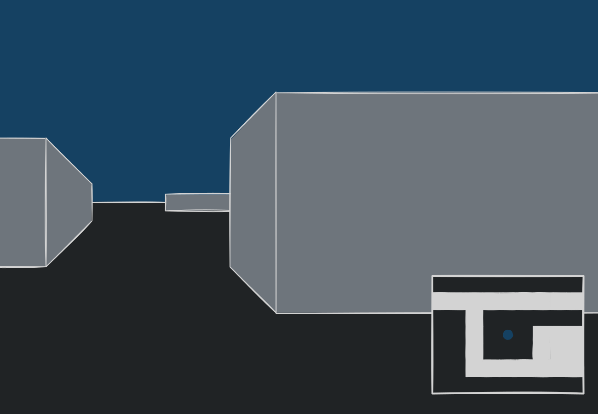
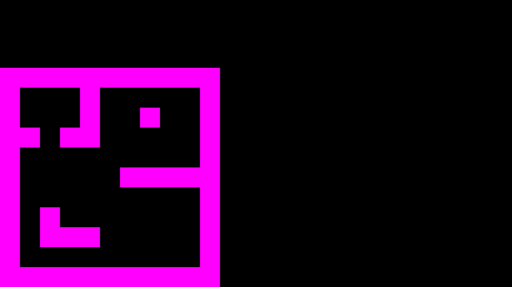
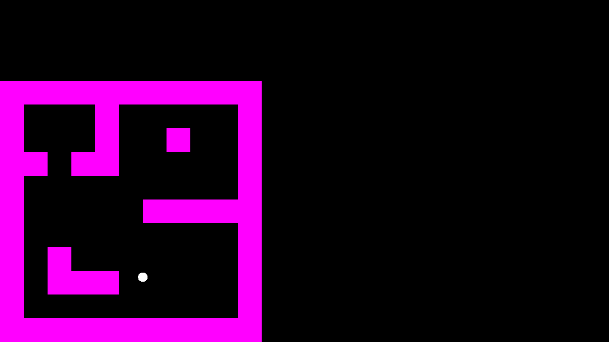
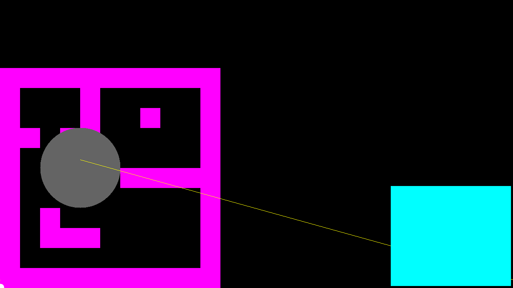
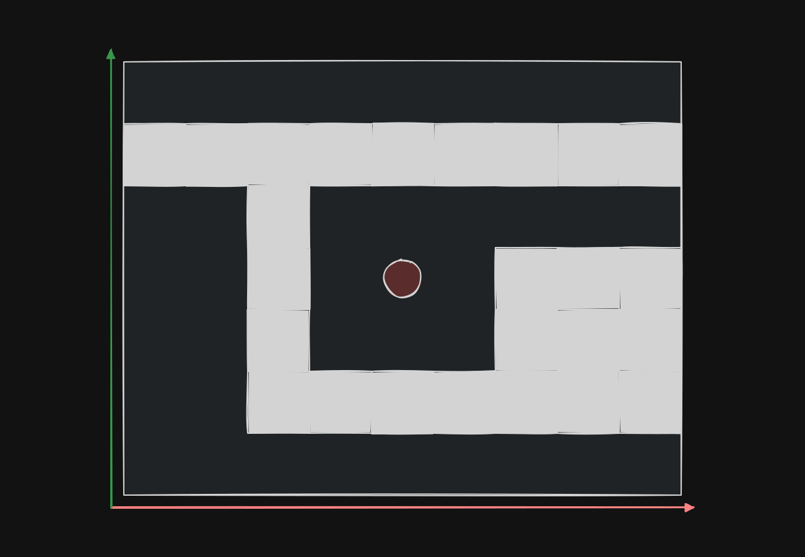
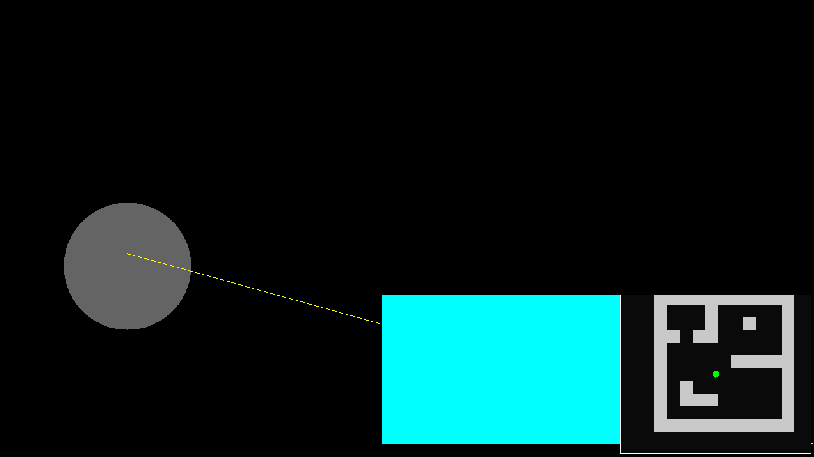

# 2 Flatworld

> [Demo](./wolfenstein-3d.html)

While this Wolf3D is attributed as the father of the FPS genre, it really is a 2D, top-down shooter from the first person, 3D perspective. As such we shall make the game from the minimap view first. 

Something along the lines of this 

## 2.1 Environment
Wolfenstein used a tile based level, where each tile could be one of various objects (walls, doors, enemy spawn, etc). So to start off simple let's go with this map:

```js
const tilemap = load_tilemap(`
###########
#   #     #
#   #  #  #
## ##     #
#         #
#     #####
#         #
# #       #
# ###     #
#      S  #
###########
`)
```

Which we will load into an array like so:

```js
const buffer_index = (x, y, w) => y * w + x
const create_rect_buffer = (w, h) => new Array(w * h);

const load_tilemap = (str) => {

    const rows = str.split("\n").map(row => row.trim()).filter(row => row.length > 0);

    const w = rows[0].length;
    const h = rows.length;

    const tilemap = create_rect_buffer(w, h);
    let i = 0;

    for (let y = 0; y < h; ++y) {
        if (h != rows[y].length) {
            console.error("Tilemap is of irregular size, must be a rectangle.")
            return null;
        }

        for (let x = 0; x < w; ++x) {
            tilemap[i] = rows[y][x]
            ++i;
        }
    }

    if (i != w * h) {
        console.error("Tilemap is of irregular size.")
        return null
    }
    return tilemap
}
```

---

And then we can draw this in a hacky way for now:

```js
const draw = (delta, viewport) => {
    for (let py = 0; py < viewport.get_viewport_h(); ++py) {
        for (let px = 0; px < viewport.get_viewport_w(); ++px) {
            // Temp scaling of the grid 
            const tile_scale = 5;
            // Map pixel to world pos
            const x = px / tile_scale;
            const y = py / tile_scale;
            
            // Map world pos to tile index
            const ix = Math.floor(x);
            const iy = Math.floor(y);
            
            const bi = bi_s(ix, iy, tilemap.w, tilemap.h);
            if (bi == undefined) continue;
            if (tilemap.buffer[bi] === '#') {
                viewport.set_pixel(px, py, 255, 0, 255);
            }
        }
    }
};
```

Which should look like this:


## 2.2 The Player

### 2.2.1 Data
Thinking about what information about a player we actually need to know:
- Movement
    - Position
    - Rotation (look direction)
    - Move Speed
- Stats
    - Health
    - Ammo
- etc...

For now we will just work on the movement data as follows:
```js
const player = {
    pos_x: 0,
    pos_y: 0,

    rot: 0,

    move_speed: 10
}
```
### 2.2.2 Moving
```js
const move = (player, v_x, v_y, delta) =>{
    player.pos_x += v_x * delta;
    player.pos_y += v_y * delta;
}
```

### 2.2.3 Input 

Using `W/A/S/D` to move. We make sure to capture all the possible inputs so that we can input multiple keys at the same time (i.e. `W`+`A` to move diagonally)

```js
const input = {
  keys: {},
  mouse: {  dx: 0, dy: 0, 
            buttons: {} 
  }
};

// Keyboard
["keydown", "keyup"].forEach(type => {
  window.addEventListener(type, e => {
    input.keys[e.key] = type === "keydown";
  });
});

// Mouse
["mousedown", "mouseup"].forEach(type => {
  canvas.addEventListener(type, e => {
    input.mouse.buttons[e.button] = type === "mousedown";
  });
});

canvas.addEventListener("mousemove", e => {
  input.mouse.dx = e.movementX;
  input.mouse.dy = e.movementY;
});

```

---

We can also contain the mouse within the screen (`canvas`) so that it feels like a game:

```js
canvas.addEventListener('click', () => { canvas.requestPointerLock(); });
```

### 2.2.4 Drawing the Player

Now lets draw the player on the minimap:

```js
const draw = (delta, viewport) => {
    for (let py = 0; py < viewport.get_viewport_h(); ++py) {
        for (let px = 0; px < viewport.get_viewport_w(); ++px) {
            // Map pixel to world pos
            const x = px / tile_scale;
            const y = py / tile_scale;

            // Map world pos to tile index
            const ix = Math.floor(x);
            const iy = Math.floor(y);

            const bi = bi_s(ix, iy, tilemap.w, tilemap.h);
            if (bi == undefined) continue;
            if (tilemap.buffer[bi] === '#') {
                viewport.set_pixel(px, py, 255, 0, 255);
            }

            const circle_sq = (x, y, cx, cy, r) => (((x - cx) * (x - cx)) + ((y - cy) * (y - cy)) - (r * r))
            if (circle_sq(px, py, player.pos_x, player.pos_y, 10) <= 0) {
                viewport.set_pixel(px, py, 255, 255, 255);
            }
        }
    }
};
```

> Which should look like this (move around with `WASD`):
>
> 
>
> I would make this animated but I am lazy :P


## 2.3 Minimap

Now that we have all the basics down, I think it is time to do it properly. That is to have a proper scaling between the world space and the pixel/screen space. So far the "minimap" has been rendered on the screen as if it is the actual game and is also in the bottom left corner. Time to fix it up.

### 2.3.1 Utils

Before we make the UI first it would be helpful to make some drawing utils so that we dont have to draw shapes in a bespoke manner each time. *Make note of the line drawing algorithm, we will need this later.*

```js
/**
 * DDA (https://en.wikipedia.org/wiki/Digital_differential_analyzer_(graphics_algorithm))
 * 
 * @param {number} x0
 * @param {number} y0
 * @param {number} x1
 * @param {number} y1
 * 
 * @param {number} r
 * @param {number} g
 * @param {number} b
 * @param {number} a
 * 
 * @return {void}
 */
const draw_line = (x0, y0, x1, y1, r, g, b, a = 255) => {
    // find m = dy/dx
    const dx = x1 - x0;
    const dy = y1 - y0;

    // use the more "aggressive" axis (longer) as the step
    const longest_axis_mangnitude = (Math.abs(dx) >= Math.abs(dy)) ? Math.abs(dx) : Math.abs(dy)
    // the move along "step axis" by 1 pixel while moving along the other axis by the slope 
    const step_x = dx / longest_axis_mangnitude;
    const step_y = dy / longest_axis_mangnitude;
    let x = x0;
    let y = y0;

    // since we only move 1 pixel in the longest magnitude axis(see above), we can iterate on it per pixel 
    for (
        let i = 0; i <= longest_axis_mangnitude; ++i) {
        // paint along the steps
        viewport.set_pixel(Math.round(x), Math.round(y),// ensure that it is the pixel position not a float
            r, g, b, a
        );

        // move to next step
        x += step_x;
        y += step_y;
    }
}

/**
 * @param {number} x0
 * @param {number} y0
 * @param {number} x1
 * @param {number} y1
 * 
 * @param {number} r
 * @param {number} g
 * @param {number} b
 * @param {number} a
 * 
 * @return {void}
 */
const draw_rect = (x0, y0, x1, y1, r, g, b, a = 255) => {
    for (let py = y0; py < y1; ++py) {
        for (let px = x0; px < x1; ++px) {
            viewport.set_pixel(px, py, r, g, b, a)
        }
    }
}

/**
 * @param {number} x0
 * @param {number} y0
 * @param {number} x1
 * @param {number} y1
 */
const dist_sq = (x0, y0, x1, y1) => ((x0 - x1) * (x0 - x1)) + ((y0 - y1) * (y0 - y1))

/**
 * @param {number} cx
 * @param {number} cy
 * @param {number} cr
 * 
 * @param {number} r
 * @param {number} g
 * @param {number} b
 * @param {number} a
 * @return {void}
 */
const draw_circle = (cx, cy, cr, r, g, b, a = 255) => {
    const cr_sq = cr * cr;

    // within an AABB do a brute force circle check
    for (let py = cy - cr; py < cy + cr; ++py) {
        for (let px = cx - cr; px < cx + cr; ++px) {
            if (dist_sq(px, py, cx, cy) - cr_sq <= 0) {
                viewport.set_pixel(px, py, r, g, b, a)
            }
        }
    }
}

const draw = (delta, viewport) => {
  // ... 

  draw_circle(200, 300, 100, 100, 100, 100)
  draw_line(200, 320, 1279, 20, 255, 255, 0);
  draw_rect(viewport.get_viewport_w() - 305, 5, viewport.get_viewport_w() - 5, 255, 0, 255, 255)
};
```

Notice how things get painted ***over*** each other, depending on the order they are drawn, this is a [Painter's Algorithm](https://en.wikipedia.org/wiki/Painter%27s_algorithm). 

> 
> The items are drawn in the following order:
> 1. The map (purple)
> 2. The player (white dot)
> 3. Circle
> 4. Line
> 5. Rect
>
> This is also the order of items "furthest" to "closest"

### 2.3.2 A Proper Minimap

Now we should draw the minimap in a more sensible position and scale. For example:

> 
> Note: the minimap does not line up with the scene - this is just for reference

To do this we take the previous shpae drawing capabilities.

---

Ok. I lied a bit, we have to make a variant first.

```js
/**
 * @param {number} x0
 * @param {number} y0
 * @param {number} x1
 * @param {number} y1
 * 
 * @param {number} r
 * @param {number} g
 * @param {number} b
 * @param {number} a
 * 
 * @return {void}
 */
const draw_rect_hollow = (x0, y0, x1, y1, r, g, b, a = 255) => {
    // Left + Right edge
    for (let py = y0; py < y1; ++py) {
        viewport.set_pixel(x0, py, r, g, b, a)
        viewport.set_pixel(x1, py, r, g, b, a)
    }

    // Top + Bottom edge
    for (let px = x0; px < x1; ++px) {
        viewport.set_pixel(px, y0, r, g, b, a)
        viewport.set_pixel(px, y1, r, g, b, a)
    }
}
```

---

Thinking in terms of local space of the frame/window we can recycle the hacky solution for a more "proper" minimap:



First we make the rect that should hold the minimap, the fill of this doubles as the background of the empty tiles. This is then followed up with drawing the tiles (that have something on them) and then the player's position (which should be centered). We make sure to apply some transformations between the local pixel space into a "normalise tile space". I also added a zoom because it looked a bit small.

```js
const draw_minimap = (delta, viewport, width, height, padding, zoom) => {
    // assume it is always aligned to the bottom right (can make this a proper thing later) 
    const x1 = viewport.get_viewport_w() - padding
    const x0 = x1 - width;
    const y0 = padding;
    const y1 = y0 + height;

    draw_rect(x0, y0, x1, y1, 10, 10, 10, 255) // BG

    // foreach pixel within the "frame"
    for (let fpy = 0; fpy < height; ++fpy) {
        for (let fpx = 0; fpx < width; ++fpx) {
            // frame pixel -> centered on zero
            const px = fpx - width / 2;
            const py = fpy - height / 2;

            // Map pixel to world pos (and offset to center on player)
            const x = player.pos_x + (px / zoom); // zoom can also be thought of as making the tiles bigger relatively speaking 
            const y = player.pos_y + (py / zoom);

            // world pos -> tile pos -> tile index (floor)
            const ix = Math.floor(x / tilemap.grid_scale);
            const iy = Math.floor(y / tilemap.grid_scale);

            // lookup correct tile and render
            const bi = bi_s(ix, iy, tilemap.w, tilemap.h);
            if (bi == undefined) continue;
            if (tilemap.buffer[bi] === '#') {
                viewport.set_pixel(x0 + fpx, y0 + fpy, 200, 200, 200);
            }
        }
    }

    draw_rect_hollow(x0, y0, x1, y1, 255, 255, 255) // Outline

    // draw player (always center)
    draw_circle(x0 + width / 2, y0 + height / 2, 5, 0, 255, 0)
}
```

Which should look like this (also see [Demo](./wolfenstein-3d.html)):




