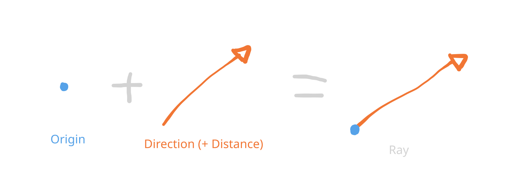
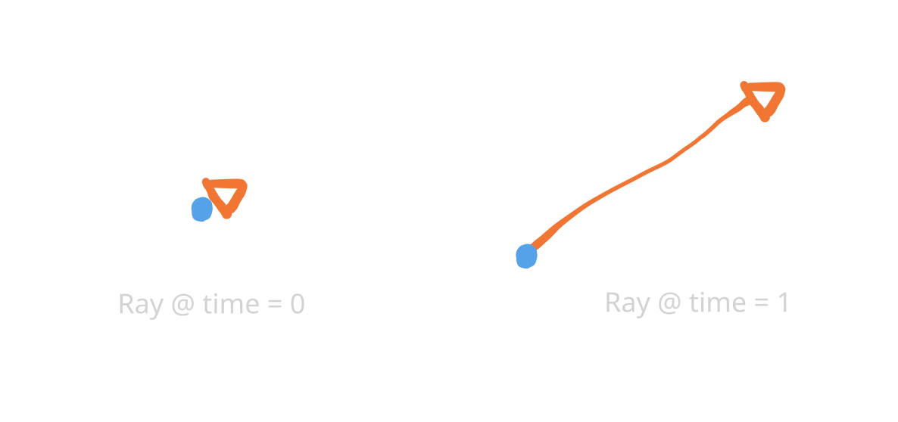
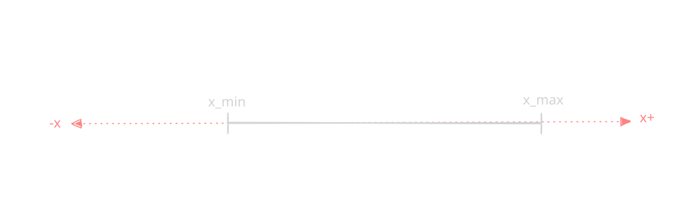
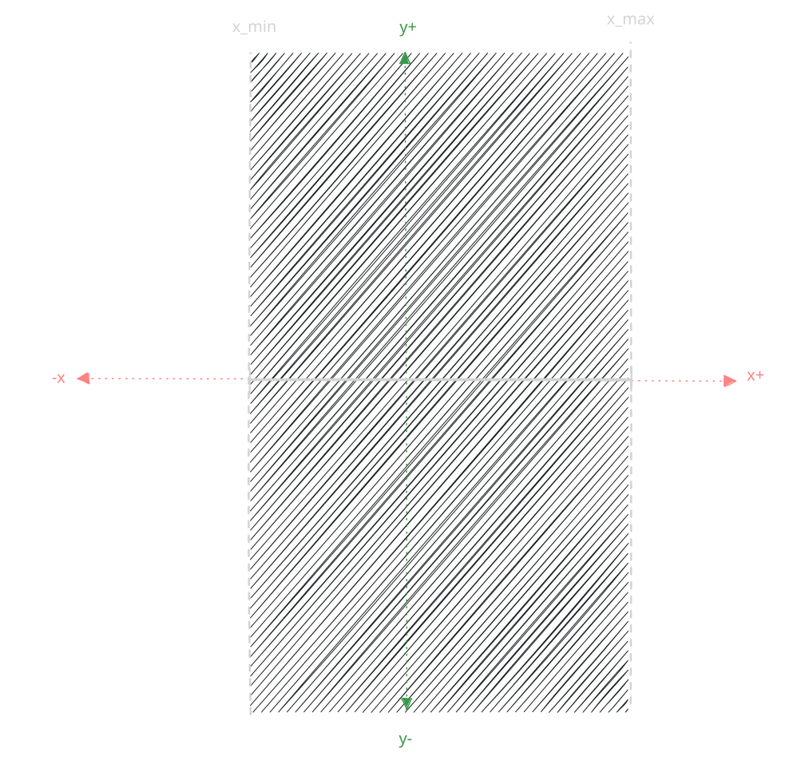
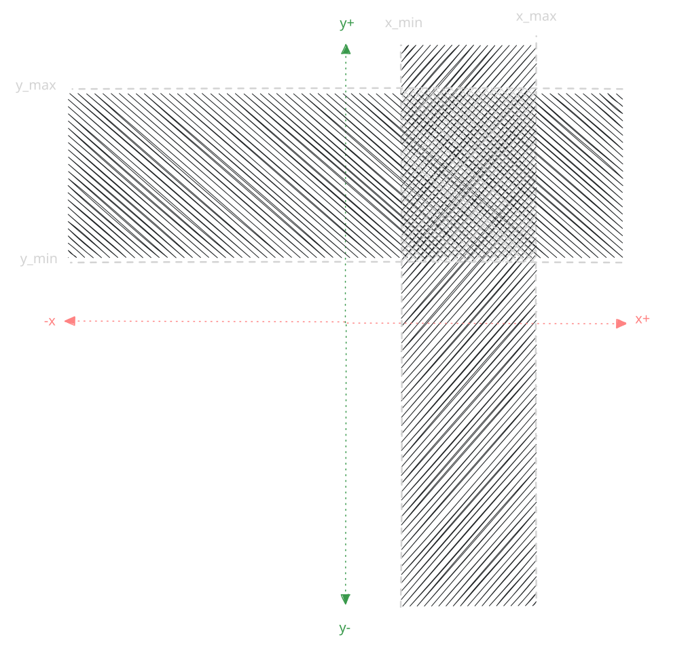
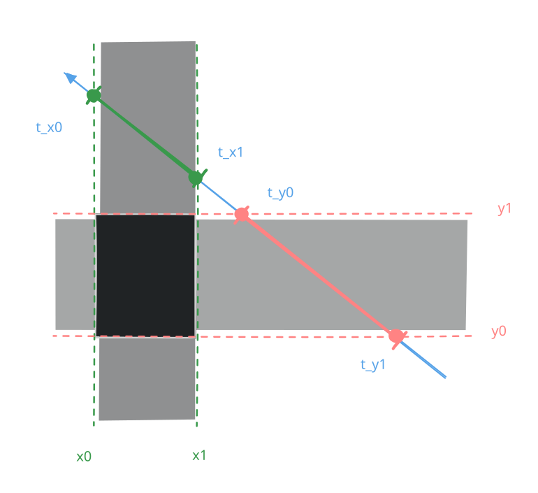
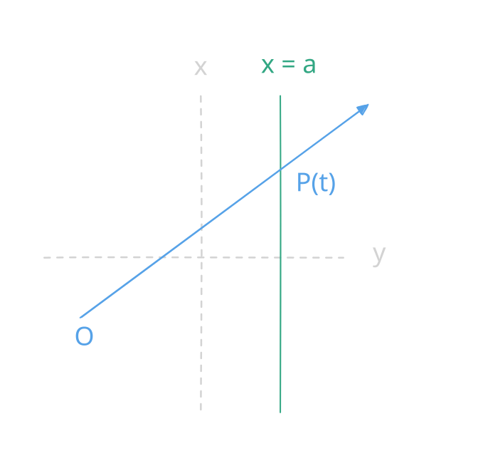

# 2. Ray Casting

Ray casting is how we will be rendering the scene. Think of it as a kind of radar for light/colour, where a beam is sent out, until it hits something, which said collision providing information on how to render a pixel (or as we find out later multiple).

## 2.1 Rays

A ray is an imaginary line draw starting at a position (origin), which travels along a direction (sometimes with a set distance).



This can be written as:

$$\vec{O} + \vec{D}$$

---



The position of a ray over time is can be written as:

$$\vec{P}(t) = \vec{O} + t \cdot \vec{D}$$

Or when view as their 2D components:
$$\vec{P_x}(t) = \vec{O_x} + t \cdot \vec{D_x}$$
$$\vec{P_y}(t) = \vec{O_y} + t \cdot \vec{D_y}$$

## 2.2 Slabs

A slab is a 1D region defined by a minimum and maxmimum on said dimension/axis:

For example in the x-axis:
$$\text{Slab}_x: x_{\min} \le x \le x_{\max}$$

A slab when viewed in 1D:


A slab when viewed in 2D:


## 2.3 Axis-Aligned Bounding Box

An axis-aligned bounding box (AABB) is a box made of multiple slabs:


## 2.5 Cutting boxes with rays

> A ray passes through an AABB in all dimensions when:
> - For each dimension (axis), there is a slab defined by an AABB in said axis,
> - If the ray overlaps with (or begins in) said slab for a range of the parametric variable $t$,
> - Such that there exists **a shared range of $t$ for all dimensions**.

---

**Click here for a [Interactive Demo](./slab_method.html)**

---

An example of a hit:


An example of a miss:



---


Further reading: Ray tracing complex scenes - Chapter 2.3: Ray-Volume Intersections *(Timothy L. Kay and James T. Kajiya. 1986. Ray tracing complex scenes. SIGGRAPH Comput. Graph. 20, 4 (Aug. 1986), 269–278. https://doi.org/10.1145/15886.15916)*

# rsgesfesdf

How that we have a level, whe can try and see into the level with rays. Since the level is a grid of squares, where each face is axis-aligned - that is it only moves in the cardinal directions. Because of this invariant, we are able to use [AABB](https://en.wikipedia.org/wiki/Minimum_bounding_box#Axis-aligned_minimum_bounding_box) techniques. For now, only think of the level from the top down in a 2D view.

---

## 2.1 Levels

To draw a level we first have to have a level... So a map it is!

Wolfenstein used a tile based level, where each tile could be one of various objects (walls, doors, enemies, etc). So to start off simple let's go with this map:

```js
const tilemap = load_tilemap(`
###########
#   #     #
#   #  #  #
## ##     #
#         #
#     #####
#         #
# #       #
# ###     #
#      S  #
###########
`)
```

Which we will load into an array like so:

```js
const buffer_index = (x, y, w) => y * w + x
const create_rect_buffer = (w, h) => new Array(w * h);

const load_tilemap = (str) => {

    const rows = str.split("\n").map(row => row.trim()).filter(row => row.length > 0);

    const w = rows[0].length;
    const h = rows.length;

    const tilemap = create_rect_buffer(w, h);
    let i = 0;

    for (let y = 0; y < h; ++y) {
        if (h != rows[y].length) {
            console.error("Tilemap is of irregular size, must be a rectangle.")
            return null;
        }

        for (let x = 0; x < w; ++x) {
            tilemap[i] = rows[y][x]
            ++i;
        }
    }

    if (i != w * h) {
        console.error("Tilemap is of irregular size.")
        return null
    }
    return tilemap
}

```
### 2.2.2 Casting Rays
In order to interact with something, the ray has to collide (intersect) with something (in this case our level). 

---

Given our assumptions of interacting with AABBs, we only have to worry about collisions against vertical or horizontal lines which can be defined as:

$$x=a$$
$$y=b$$


---

For now we will work on the x axis only.

The point of intersection between a ray and the x-axis is (with an unknown $t$):



$$\vec{P_x}(t) = a$$

To solve for t:
$$\vec{P_x}(t) = \vec{O_x} + t \cdot \vec{D_x} = a$$
$$t = \frac{a - \vec{O_x}}{\vec{D_x}}$$

We know that if for any $t$ if the above can be solved, then the ray will intersect the line at $x=a$.

### 2.2.3 Missing Rays
A special case of the above is when the ray is also axis-aligned. This will be when Dy = 0 and Dx = 0 for an vertical and horizontal ray respectivly.  
$$\vec{D_x} = 0 \quad \text{or} \quad \vec{D_y} = 0$$
