# 3 Rendering

> [Demo](./wolfenstein-3d.html)


Looking from above is awfully boring so time to do what we really came here to do which is to render this in 3D.

## 3.1 Theory

Here I will go through the steps from converting a 3D world into a 2D image using a method called raycasting.

### 3.1.1 Everything Is Cooler with Lasers

We already know our world can be represented in 2D as a top-down "flat world" so lets think about it that way for now. Imagine we have a 2D radar that shoots lazers from a single pinhole, where we project out rays at incremental angles, which can tell us how **far** and what **colour** is an ***object it hit*** (if it hit one at all)

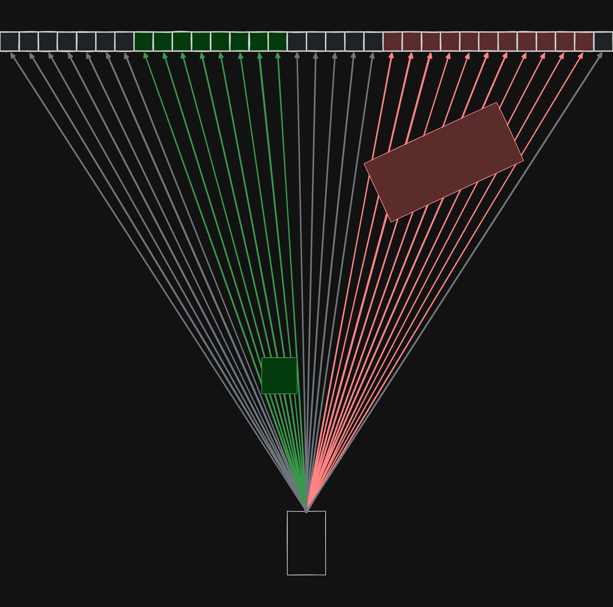

Which to the radar, looks like this:

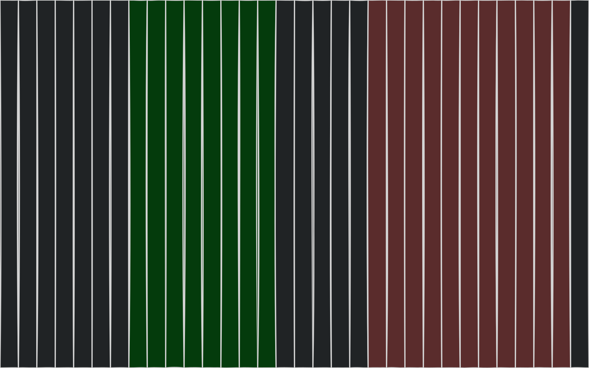

Which we can process by removing the borders between each "vertical pixel"

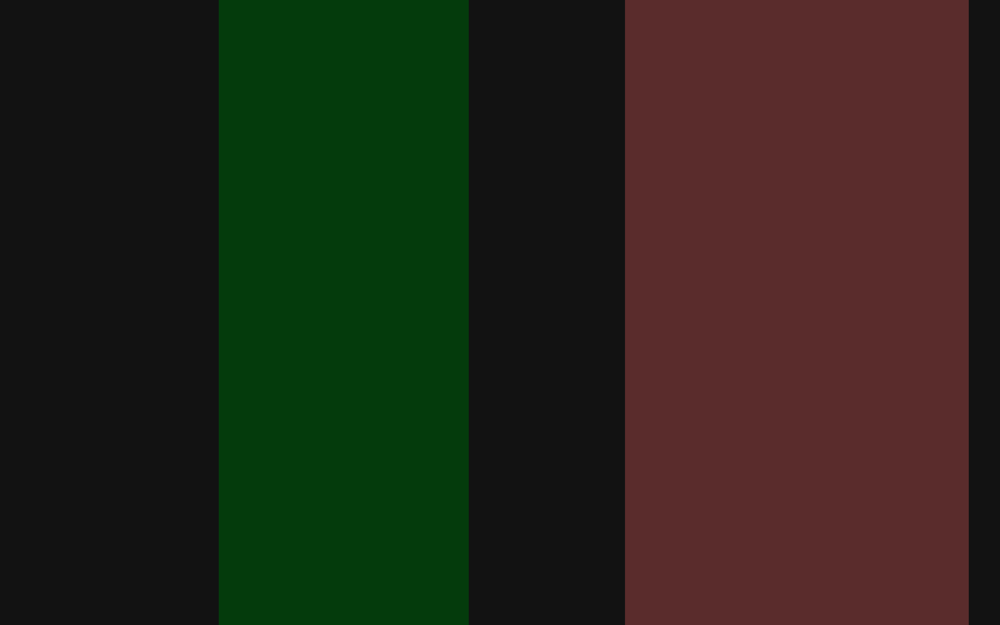

### 3.1.2 ~~New~~ Fake Horizons

Right now it doesn't look too convincing so we can add a (fake) horizon, sky and floor to the image.

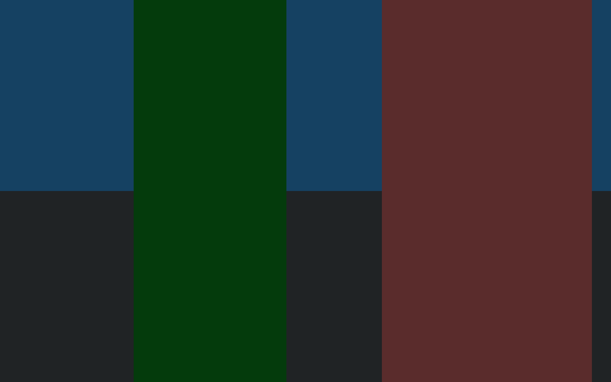

Looks a bit better but still awkward right?

### 3.1.3 You Are Looking at It Wrong: It’s All About Perspective

Remember I mentioned distance before? Well here we scale the vertical pixel's height with how far away the object was before a ray hit it.

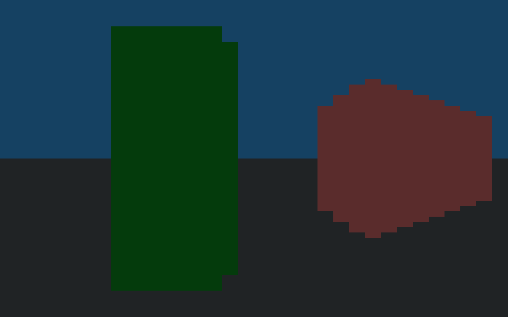

Here is the layout for reference:


### 3.1.4 RTX On (what if we just had more pixels)

To make it look even better, here's what it would look like with much more pixels, instead of having only a screen with ~30 pixels wide. On top of that we can add some light to sides facing an arbitrary room light (shading).

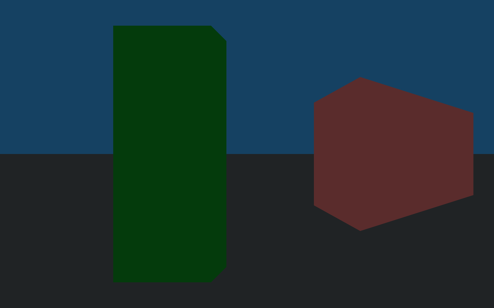

Looks pretty good right? (I cheated a bit by using polygons but I am not drawing that many pixels)

## 3.2 FPS Inputs

So far we have been playing the game from the top down, and moving in global space, where `W/A/S/D` corresponds to North/West/South/East respectively.

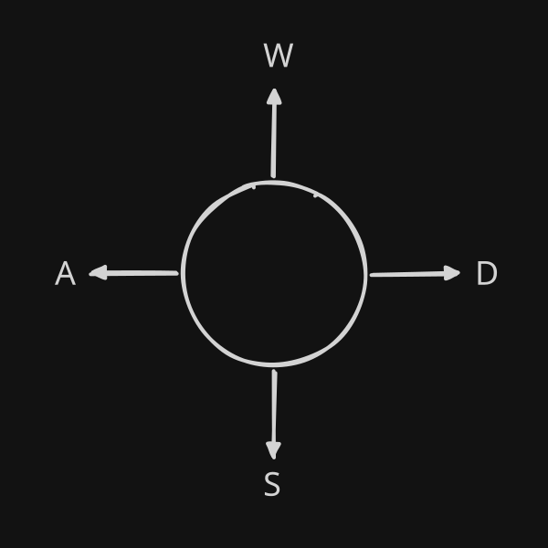

But as a shooter, the control scheme should be using relative directions of forward and strafe/right (which direction is forward when rotation is 0 is arbitrary):

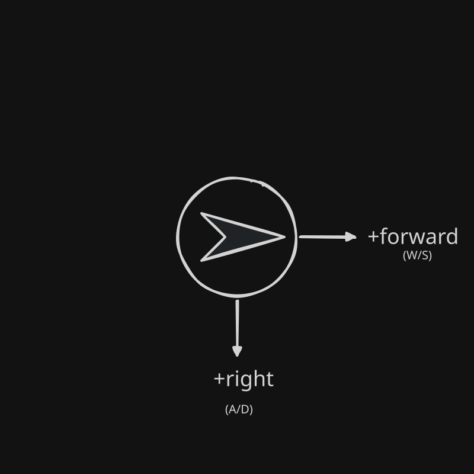

We do this by rotating the input to be relative to the player's direction. We can also use our mouse to rotate. 

```js
const move = (player, axis_fwd, axis_strafe, delta) => {
    /**
     *     -strafe
     *       |
     *     --@----- > +forwards
     *       |
     *       v
     *     +strafe
     */
    if ((axis_fwd != 0 || axis_strafe != 0)) {
        const length = Math.sqrt(axis_fwd * axis_fwd + axis_strafe * axis_strafe);
        const local_x = axis_fwd / length;
        const local_y = axis_strafe / length;

        const looking_x = Math.cos(player.rot);
        const looking_y = Math.sin(player.rot);

        const move_x = local_x * looking_x + local_y * looking_y;
        const move_y = local_x * looking_y - local_y * looking_x;
        const velocity = player.move_speed * delta;
        player.pos_x += move_x * velocity;
        player.pos_y += move_y * velocity;
    }
}

let sens = 0.35;
let axis_strafe = 0;
let axis_forwards = 0;

const tick = (delta) => {
    //strafe
    axis_strafe = 0
    if (input.keys.a) { axis_strafe += -1; }
    if (input.keys.d) { axis_strafe += 1; }
    //forwards
    axis_forwards = 0
    if (input.keys.s) { axis_forwards += -1; }
    if (input.keys.w) { axis_forwards += 1; }
    //look
    if (input.mouse.dx) {
        player.rot += sens * -input.mouse.dx * delta; // -ve = non-inverted mouse
        input.mouse.dx = 0; // consume the delta after reading otherwise it will continue with no input
    }

    move(player, axis_forwards, axis_strafe, delta)
}
```

## 3.3 Raycasting

### 3.3.1 Rays on Grids

To implement the rays, we can make use of a variation to the DDA, accounting for the position being a decimal position within a cell. We also scale the coordinates by the tilemap scale so that the calculations apply at the right distances. 

> https://lodev.org/cgtutor/raycasting.html does a far better job of explaining it.

```js
const DEG2RAD = Math.PI / 180;
const FOV_DEFAULT_DEG = 90 // source-like default
let fov = FOV_DEFAULT_DEG * DEG2RAD;

/**
 * @param{Tilemap} tilemap
 * @param{number} ox       
 * @param{number} oy      
 * @param{number} dx
 * @param{number} dy
 * @param{number} max_dist
 */
const raycast_dda = (tilemap, ox, oy, dx, dy, max_dist) => {
    // Scale positions to tilemap coords
    ox /= tilemap.grid_scale;
    oy /= tilemap.grid_scale;
    dx /= tilemap.grid_scale;
    dy /= tilemap.grid_scale;
    max_dist /= tilemap.grid_scale;

    // Cell positions are always ints
    let cx = Math.floor(ox);
    let cy = Math.floor(oy);

    // Diagonal distance from the edges of x to x+1 (or y to y+1)
    const diag_dist_x = Math.abs(1 / dx);
    const diag_dist_y = Math.abs(1 / dy);

    // Distance to nearest edge along said axis
    let edge_dist_x;
    let edge_dist_y;

    // Direction to step in
    let step_x;
    let step_y;

    // Calculate initial step (to a cell edge)
    if (dx < 0) {
        step_x = -1;
        edge_dist_x = (ox - cx) * diag_dist_x;
    } else {
        step_x = 1;
        edge_dist_x = (cx + 1.0 - ox) * diag_dist_x;
    }

    if (dy < 0) {
        step_y = -1;
        edge_dist_y = (oy - cy) * diag_dist_y;
    } else {
        step_y = 1;
        edge_dist_y = (cy + 1.0 - oy) * diag_dist_y;
    }

    let side = 0;
    let perp_dist = 0;

    // DDA loop
    while (perp_dist <= max_dist) {
        // Choose the axis to "snap" to which requires moving along the diagonal the least
        if (edge_dist_x < edge_dist_y) {
            perp_dist = edge_dist_x;
            edge_dist_x += diag_dist_x;
            cx += step_x;
            side = 0;
        } else {
            perp_dist = edge_dist_y;
            edge_dist_y += diag_dist_y;
            cy += step_y;
            side = 1;
        }

        const bi = bi_s(cx, cy, tilemap.w, tilemap.h);
        if (bi == undefined) {
            return null;
        }

        const cell = tilemap.buffer[bi];
        if (cell == '#') {
            return {
                side: side,
                cell: cell,
                cell_pos_x: cx,
                cell_pos_y: cy,
                perp_dist: perp_dist,
            };
        }
    }
    return null;
};
```

### 3.3.3 Rendering

As mentioned before the distance to the surface is used to draw the height of the wall. To ensure that we do not suffer from the fisheye effect, we use the perpendicular distance of the ray, to the walls are projected with straight edges. A max distance is used for sanity (although all Wolf3D maps are always "boxed in" so the ray length could be infinite).

If you noticed before, we kept track of the `side` (N/S or E/W) of the surface that was hit. This is used to give more of a 3D feel, as only 2 sides will ever be visible (one from each group). I also added some shading based on the distance the wall is so that near and far walls can be more easily distinguished.

> Again see: https://lodev.org/cgtutor/raycasting.html.

```js
const render_scene = (delta, viewport, max_render_dist) => {
    const w = viewport.get_viewport_w();
    const h = viewport.get_viewport_h();

    // Camera / player look direction  
    const look_dir_x = Math.cos(player.rot);
    const look_dir_y = Math.sin(player.rot);

    // The camera plane (a line in 2D) defined by a 2D vector
    //                      
    //                         plane width
    //                     +-----------------+ 
    //                     ___________________ 
    //                  +  \        |        /
    //                  |   \       |       /
    //                  |    \      |      /
    //                  |     \     |     /
    //   plane distance |      \    |    /
    //                  |       \   |   /
    //                  |        \  |  /   
    //                  |         \ | / \___ FoV   
    //                  |          \|/
    //                  +           v
    //                              @
    //                            
    //

    // Scaling the camera plane based on the fov (a ratio between the distance of the plane and the (half-)width)
    const fov_proportion = Math.tan(fov / 2)

    // The camera plane (x+ is the "forward" of the camera at rotation = 0)
    //
    //     y+
    //     ^            
    //     |          /
    //     +--> x+   / 
    //              /  
    //             /   
    //            /    
    //           @----->  look dir            + 
    //            \                           | camera plane
    //             \                          |
    //              \                         v
    //               \ 
    //                \
    //                 
    // Convert the camera plane from local space to world space
    const cam_plane_x = -look_dir_y * fov_proportion;
    const cam_plane_y = look_dir_x * fov_proportion;

    // Cache the calculation of the wall height scaling
    const wall_scale_factor = (h * tilemap.grid_scale) / fov_proportion;

    // Foreach vertical pixel
    for (let px = 0; px < w; ++px) {
        // Map the pixel to the offset from the center of the plane
        const offset_along_plane = 1 - (2 * px / w);
        // Take the raycast direction
        const dx = look_dir_x + cam_plane_x * offset_along_plane;
        const dy = look_dir_y + cam_plane_y * offset_along_plane;

        const hit = raycast_dda(tilemap, player.pos_x, player.pos_y, dx, dy, max_render_dist);
        if (hit != null) {
            // Height of the hit wall
            const line_height = Math.floor(wall_scale_factor / hit.perp_dist);

            let py_wall_bottom = (h - line_height) / 2;
            let py_wall_top = (h + line_height) / 2;

            const shade = 1 - Math.sqrt(hit.perp_dist / max_render_dist);
            const color = 220 * shade * (hit.side === 1 ? 0.6 : 1);

            // Draw
            for (let py = 0; py < h; ++py) {
                if (py < py_wall_bottom) {
                    // Floor
                    viewport.set_pixel(px, py, 39, 45, 45);
                } else if (py_wall_top < py) {
                    // Celing / Sky
                    viewport.set_pixel(px, py, 25, 40, 100);
                } else {
                    // Wall
                    viewport.set_pixel(px, py, color, color, color);
                }
            }
        } else {
            // ERROR - failed to hit tile
            for (let py = 0; py < h; ++py) {
                viewport.set_pixel(px, py, 255, 0, 255);
            }
        }
    }
};
```

After all that hard work the code should be able to do this:

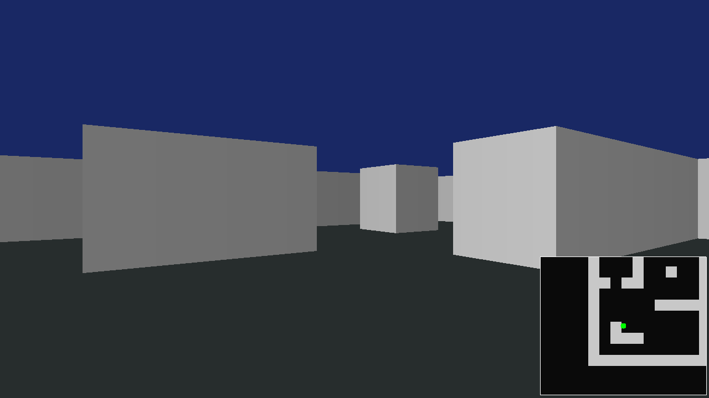

## 3.4 Texture Mapping
Coloured squares are good and all but they just don't *feel* right...

### 2.4.1 How does it work?
As the name implies when a wall is drawn, the position where the ray hit is mapped to a position on the texture which informs what colour the pixel should be. We call these new positions `u` and `v` rather than `x` and `y`. For example, in the image below, the sampled pixel will be red.

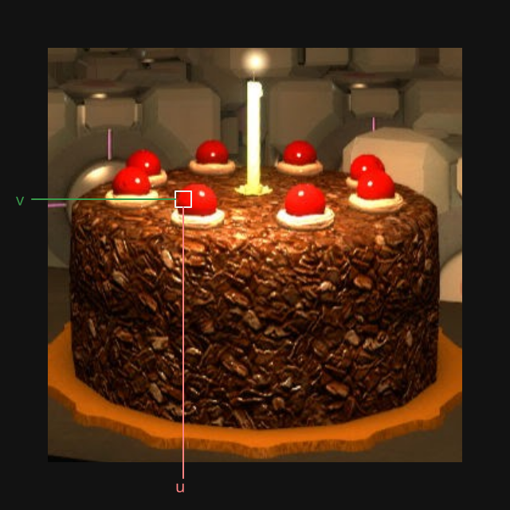

A very real cake.

### 3.4.2 Where was the hit?

To do so we can make some quick changes to the raycaster to be able to find the `u` position. to conver from the world/cell space (below) to a the texture/uv space (above).

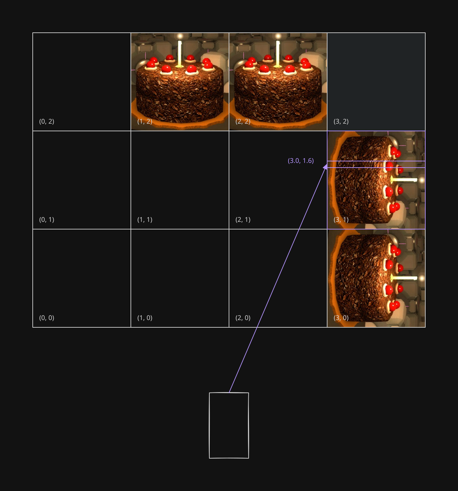

Note that we only want the `u` coordinate and not the `v` as we will loop through the whole vertical when we render. As such we should check which side was hit, and use that as the `u` axis. Make sure that the position is a scale from 0 to 1, that is from left to right of the texture.

```js
if (cell == '#') {
    // The horizontal position along a texture (x but for a texture)
    let tex_u;
    // Find the position that the ray collided
    const hit_x = ox + perp_dist * dx;
    const hit_y = oy + perp_dist * dy;

    if (side == 0) {
        // Hit a wall aligned with y-axis
        // So u should be based on the y position
        tex_u = hit_y - Math.floor(hit_y);
        // Reverse position when hitting from opposite direction (un-flip so the texture faces the correct way)
        if (dx < 0) tex_u = 1.0 - tex_u;
    } else {
        // Hit a wall aligned with x-axis
        tex_u = hit_x - Math.floor(hit_x);
        if (dy > 0) tex_u = 1.0 - tex_u;
    }

    return {
        side: side,
        cell: cell,
        cell_pos_x: cx,
        cell_pos_y: cy,
        perp_dist: perp_dist,
        tex_u: tex_u
    };
}
```
To test this out we can make a hacky "texture" that is red on the left and green on the right.

```js
// Wall
if (hit.tex_u < 0.5) {
    viewport.set_pixel(px, py, 100 * shade, 255 * shade, 100 * shade);
}
else {
    viewport.set_pixel(px, py, 255 * shade, 100 * shade, 100 * shade);
}
```

It is not very pretty but we know it works now. 
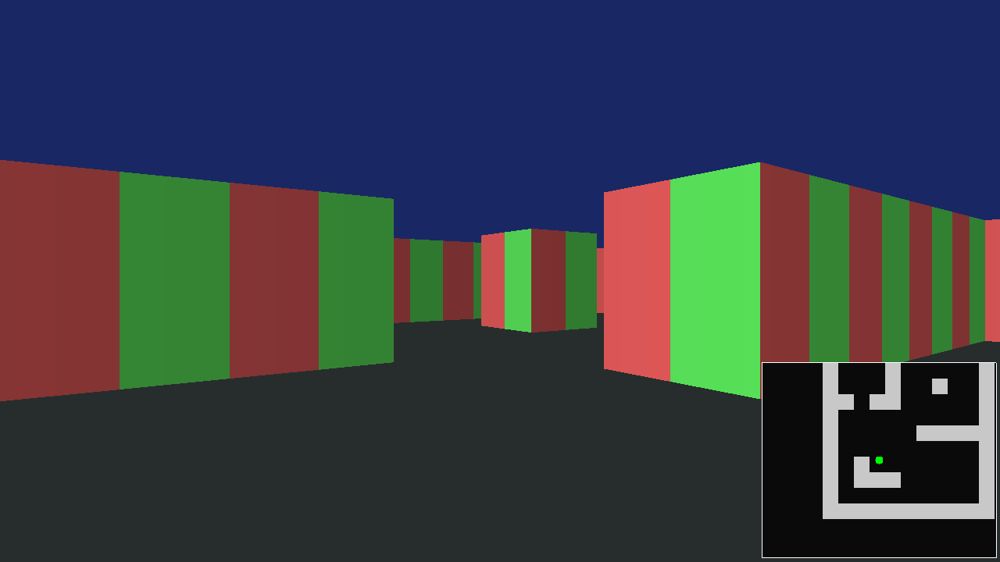

### 3.4.2 Loading a texture

> You can use any image (preferably a square image). Here I used `floor_stone.png` from https://kenney.nl/assets/retro-textures-fantasy.
> 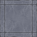

Now this is specificially because I chose to do this on a canvas and want there to be a fully offline file. which means that loading an image in is a bit harder. This requires the image to be embedded within the HTML which it does not support. However since the image is small enough, it can be embedded as a bit of binary data, a `base64` which can then be covnerted before the game starts to an image buffer.

---

First we have to get an image as a `base64`. As I am now on Linux I will use bash. [If you are too lazy to do this, here is what I got.](./../resources/textures/floor_stone.txt)

```sh
base64 -i IMAGE > OUTPUT
```

Now load the image into memory as a buffer that we can inspect. The canvas already has functionality to create raw pixel buffers so we will borrow this (image decoding is not my focus right now and it is a once off function).

```js
/**
 * @param {string} b64
 * @returns {Promise<Texture>}
 */
const b64_to_img = async (b64) => {
    if (!b64.startsWith("data:")) {
        b64 = "data:image/png;base64," + b64;
    }

    const img = new Image();
    img.src = b64;

    await img.decode(); 

    const canvas = document.createElement("canvas");
    canvas.width = img.width;
    canvas.height = img.height;

    const ctx = canvas.getContext("2d");
    ctx.drawImage(img, 0, 0);

    const { data } = ctx.getImageData(0, 0, img.width, img.height);
    return { buffer: data, w: img.width, h: img.height };
}

const TEX_WALL = await b64_to_img("YOUR B64 STRING HERE");
```

### 3.4.2 Mapping `(x, y)` to `(u, v)`
Now add change the rendering code to use the texture, converting the `(x, y)` coordinates (cell space) to `(u, v)` (texture space). And tehn pull the colour data, remembering that it is a 1D array of `R, G, B, A, R, G, ...`.

```js
if (hit != null) {
    // Calc the x/u position first since we already know all that we need for a vertical  
    // X position of the pixel that maps to the ray hit within the texture
    let u = Math.floor(hit.tex_u * TEX_WALL.w);
    // Clamp within texture bounds
    u = Math.max(0, Math.min(u, TEX_WALL.w - 1));

    // Height of the hit wall
    const line_height = Math.floor(wall_scale_factor / hit.perp_dist);

    let py_wall_bottom = (h - line_height) / 2;
    let py_wall_top = (h + line_height) / 2;

    const shade =
        (1 - Math.sqrt(hit.perp_dist / max_render_dist)) // Shade based on distance
        * (hit.side === 1 ? 0.6 : 1); // Shade based on side

    // Draw vertical
    for (let py = 0; py < h; ++py) {
        if (py < py_wall_bottom) {
            // Floor
            viewport.set_pixel(px, py, 39, 45, 45);
        } else if (py_wall_top < py) {
            // Celing / Sky
            viewport.set_pixel(px, py, 25, 40, 100);
        } else {
            // TODO: this maths could be optimised later
            let ty = Math.floor((py - py_wall_bottom) / (py_wall_top - py_wall_bottom) * TEX_WALL.h);
            // Clamp within texture bounds
            ty = Math.max(0, Math.min(ty, TEX_WALL.h - 1));

            // Convert to position in texture buffer
            const uv_idx = (ty * TEX_WALL.w + u) * 4;
            // Extract as colour 
            const r = TEX_WALL.buffer[uv_idx];
            const g = TEX_WALL.buffer[uv_idx + 1];
            const b = TEX_WALL.buffer[uv_idx + 2];

            // Draw with shading
            viewport.set_pixel(px, py, r * shade, g * shade, b * shade);
        }
    }
} else {
    // ERROR - failed to hit tile
    for (let py = 0; py < h; ++py) {
        viewport.set_pixel(px, py, 255, 0, 255);
    }
}
```

Which should look like this:
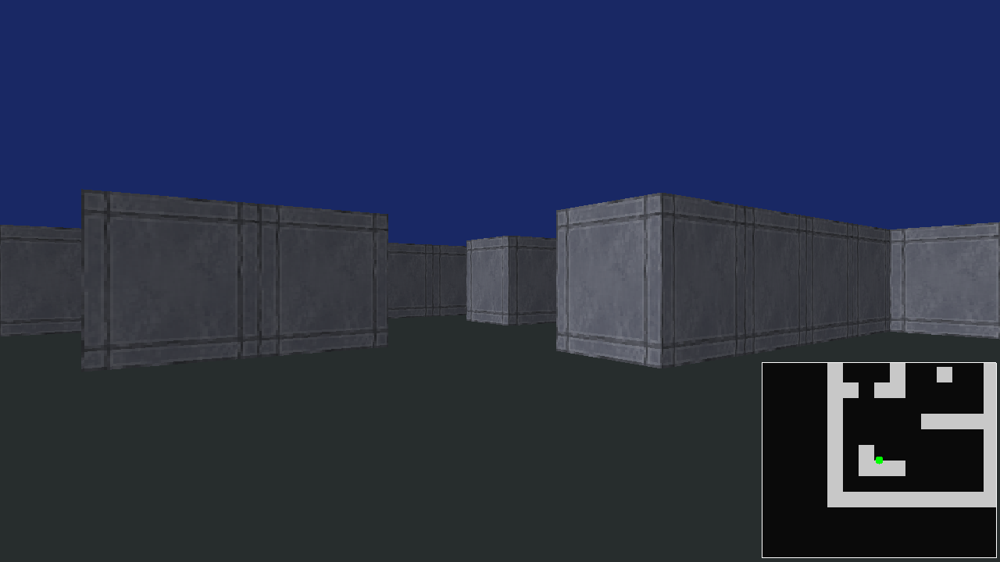
