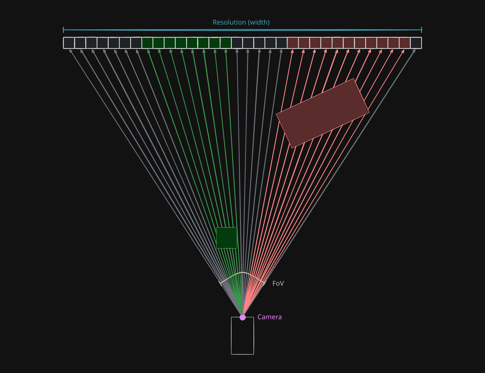

# 3 Rendering

Looking from above is awfully boring so time to do what we really came here to do which is to render this in 3D.

## 3.1 Theory

Here I will go through the steps from converting a 3D world into a 2D image using a method called raycasting.

### 3.1.1 Everything Is Cooler with Lasers

We already know our world can be represented in 2D as a top-down "flat world" so lets think about it that way for now. Imagine we have a 2D radar that shoots lazers from a single pinhole, where we project out rays at incremental angles, which can tell us how **far** and what **colour** is an ***object it hit*** (if it hit one at all)


Which to the radar, looks like this:


Which we can process by removing the borders between each "vertical pixel"


### 3.1.2 ~~New~~ Fake Horizons

Right now it doesnt look too convincing so we can add a (fake) horizon, sky and floor to the image.


Looks a bit better but still awkward right?

### 3.1.3 You Are Looking at It Wrong: It’s All About Perspective

Remember I mentioned distance before? Well here we scale the vertical pixel's height with how far away the object was before a ray hit it.


Here is the layout for reference:


### 3.1.4 RTX On (what if we just had more pixels)

To make it look even better, heres what it would look like with much more pixels, instead of having only a screen with ~30 pixels wide. On top of that we can add some light to sides facing an arbitrary room light (shading).


Looks pretty good right? (I cheated a bit by using polygons but I am not drawing that many pixels)

## 3.2 FPS Inputs

So far we have been playing the game from the top down, and moving in global space, where `W/A/S/D` corresponds to North/West/South/East respectively.


But as a shooter, the control scheme should be using relative directions of forward and strafe/right (which direction is forward when rotation is 0 is arbitrary):


We do this by rotating the input to be relative to the player's direction. We can also use our mouse to rotate. 

```js
const move = (player, axis_fwd, axis_strafe, delta) => {

    /**  
     *     
     *       |
     *     --@----- > +forwards
     *       |
     *       v
     *     +strafe
     */

    const forward_x = Math.cos(player.rot) * axis_fwd;
    const forward_y = Math.sin(player.rot) * axis_fwd;

    const strafe_x = Math.sin(player.rot) * axis_strafe;
    const strafe_y = -Math.cos(player.rot) * axis_strafe;

    player.pos_x += (forward_x + strafe_x) * delta;
    player.pos_y += (forward_y + strafe_y) * delta;
}


let sens = 0.2;
let axis_strafe = 0;
let axis_forwards = 0;

const tick = (delta) => {
    //forwards
    if (input.keys.s) {
        axis_strafe += -player.move_speed;
    }
    if (input.keys.w) {
        axis_strafe += player.move_speed;
    }
    //strafe
    if (input.keys.a) {
        axis_forwards += -player.move_speed;
    }
    if (input.keys.d) {
        axis_forwards += player.move_speed;
    }
    //look
    if (input.mouse.dx) {
        player.rot += sens * -input.mouse.dx * delta; // -ve = non-inverted mouse
        input.mouse.dx = 0; // consume the delta after reading otherwise it will continue with no input
    }

    move(player, axis_strafe, axis_forwards, delta)
}
```

## 3.3 Raycasting

### 3.3.1 Variables


- cam pos
- fov
- res

---

- while we are at it make it so that the player rotates and moves in the local direction

### 3.3.2 Lines on Grids

- this time used for collisions
- dda
- get distance and scale pixel
- get colour

### 3.3.3 Shading

- when hit if east/west uses normal colours
    - N/S darkens the colours
- potentially could upgrade by baking the lighting upon loading the map

## 3.4 Texture Mapping


## 2.4 Further Reading:
1. Lode's Computer Graphics Tutorial - Raycasting *(https://lodev.org/cgtutor/raycasting.html)*
2. Wikipedia - Digital Differential Analyzer *(https://en.wikipedia.org/wiki/Digital_differential_analyzer_(graphics_algorithm))*