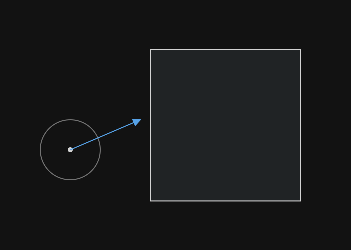
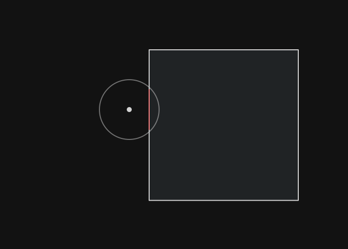
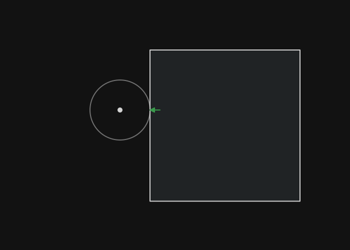
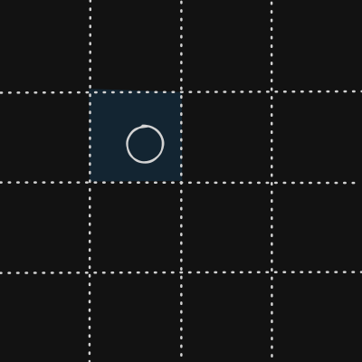
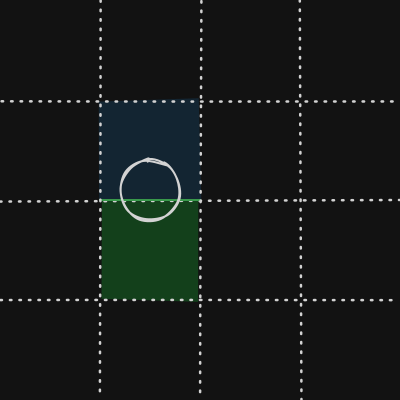
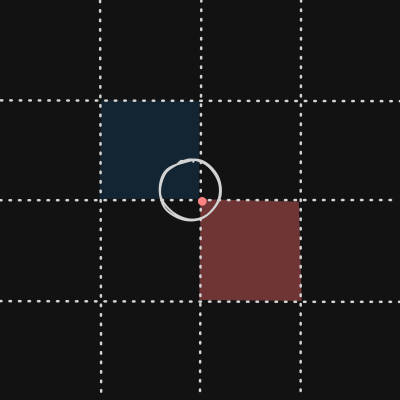
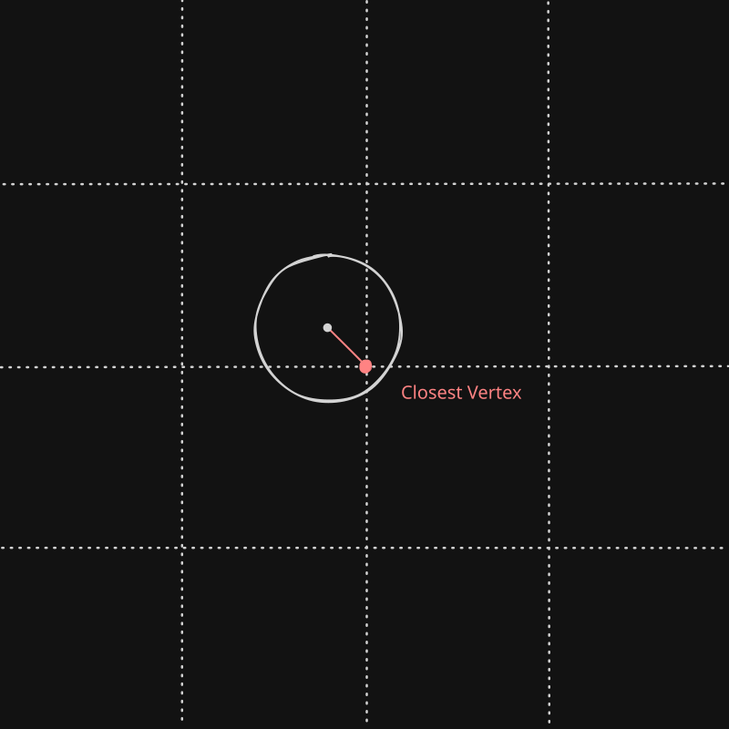
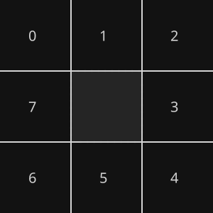

# 4 Collisions

> [Demo](./wolfenstein-3d.html)

So far I we have just been a ghost in the ~~machine~~ maze, just phasing through walls, here we change that.

## 4.1 Theory

### 4.1.1 Aim

What we are trying to do is to be able to collide with an object and ensure it does not pass through a solid wall.Note that physics is discete as we only upadate once per physics tick.

> 1. **A player moving towards a wall**




> 2. **The object moved too fast and is inside a wall**



> 3. **Correcting the object's position so that the overlap "never happened"**




### 4.1.2 Invariants

Given the type of game this is there are 3 invariants which can make our lives easier:

1. The player's collider is a circle
3. The world is made of square cells in a grid
2. The diameter of the circle is smaller than the width/height of a cell

### 4.1.3 Cases

There are 3 possible types of collisions to deal with:

> **1: Self Position**



The cell that the center of the circle belongs to will always be overlapping

> **2: Cardinal Neighbours**



If an edge (either horizontal or vertical) was crossed then collisions should be evaluated for said neighbouring tile

> **3: Diagonal Neighbours**



If the circle overlaps with the "closest vertex" then it has to account for the diagonal's collisions

### 4.1.4 Resolving Intersections

We find the minimum translation vector





```js
const calc_diag_mtv = (circle_x, circle_y, circle_r, vertex_x, vertex_y) => {
    const normal_x = circle_x - vertex_x;
    const normal_y = circle_y - vertex_y;

    const dist = sqrt(normal_x * normal_x + normal_y * normal_y);

    const normal_dir_x = normal_x / dist;
    const normal_dir_y = normal_y / dist;

    const mtv_diag_x = (circle_r-d) * normal_x
    const mtv_diag_y = (circle_r-d) * normal_y 
    return [mtv_diag_x, mtv_diag_y]
}

const calc_mtv = (tilemap, scale, player) => {
    let flag = 0b00000000;

    flag += 0b10000000 * (tilemap[tx-1][ty+1])
    flag += 0b01000000 * (tilemap[tx  ][ty+1])
    flag += 0b00100000 * (tilemap[tx+1][ty+1])
    flag += 0b00010000 * (tilemap[tx+1][ty  ])
    flag += 0b00001000 * (tilemap[tx+1][ty-1])
    flag += 0b00000100 * (tilemap[tx  ][ty-1])
    flag += 0b00000010 * (tilemap[tx-1][ty-1])
    flag += 0b00000001 * (tilemap[tx-1][ty  ])

    // Position within cell
    const rel_x = x % scale;
    const rel_y = y % scale;

    let mtv_x = 0;
    let mtv_y = 0;

    // (flag & mask) == compare
    if ((flag & 0b11000001) == 0b10000000){
        if (dist_sq(rel_x, rel_y, 0, scale) < r*r) { // top left
            mtv_x, mtv_y = calc_diag_mtv(rel_x, rel_y, player.radius, 0, scale) 
        }
    }
    if ((flag & 0b01110000) == 0b00100000){
        if (dist_sq(rel_x, rel_y, scale, scale) < r*r) { // top right
            mtv_x, mtv_y = calc_diag_mtv(rel_x, rel_y, player.radius, scale, scale)
        }
    }
    if ((flag & 0b00011100) == 0b00001000){
        if (dist_sq(rel_x, rel_y, scale, 0) < r*r) { // bottom right
            mtv_x, mtv_y = calc_diag_mtv(rel_x, rel_y, player.radius, scale, 0)
        }
    }
    if ((flag & 0b00000111) == 0b00000010){
        if (dist_sq(rel_x, rel_y, 0, 0) < r*r) { // bottom left
            mtv_x, mtv_y = calc_diag_mtv(rel_x, rel_y, player.radius, 0, 0)
        }
    }

    const scale_sub_r = scale - r; // cache for below
    // overwrite if needed (will always be an equal or "stronger" repulsion)
    if (flag & 0b01000000){
        if (rel_y > scale_sub_r) mtv_y = rel_y - scale_sub_r; // Up
    }
    if (flag & 0b00010000){
        if (rel_x > scale_sub_r) mtv_x = rel_x - scale_sub_r; // Right
    }
    if (flag & 0b00000100){
        if (rel_y < r) mtv_y = r - rel_y; // Down
    }
    if (flag & 0b00000001){
        if (rel_x < r) mtv_x = r - rel_x; // Left
    }
}

```

## 4.2 Code


## 4.3 Slide on Collision
- now make it slide on walls
