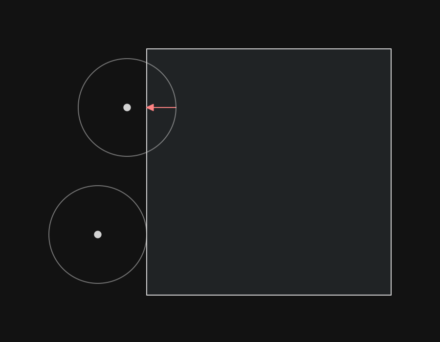
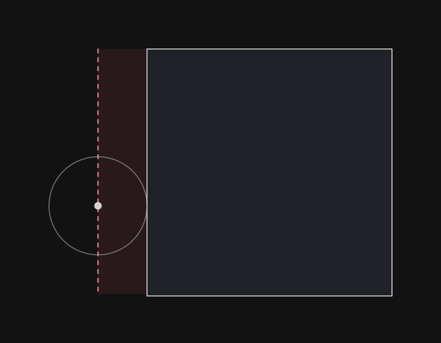
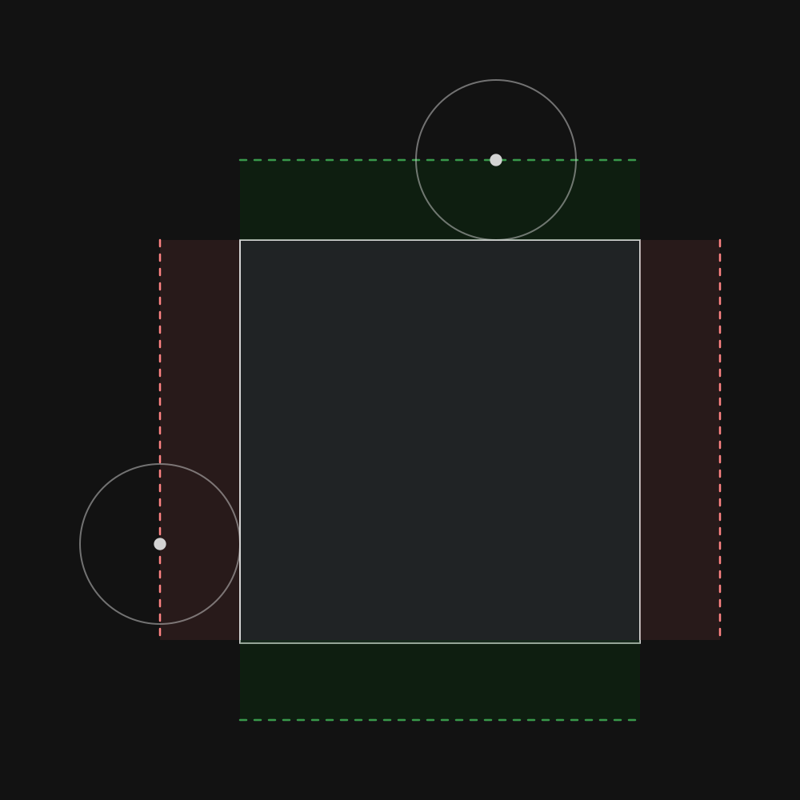
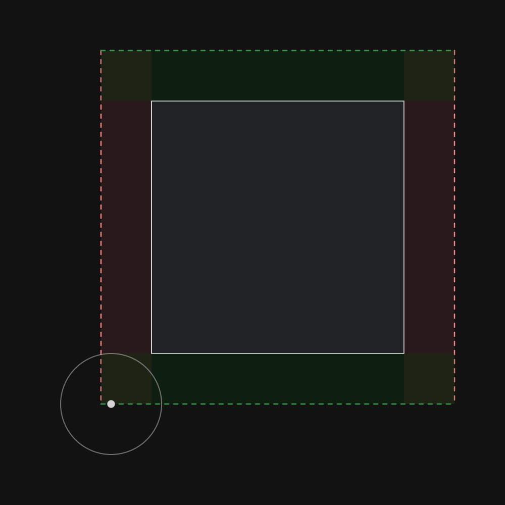
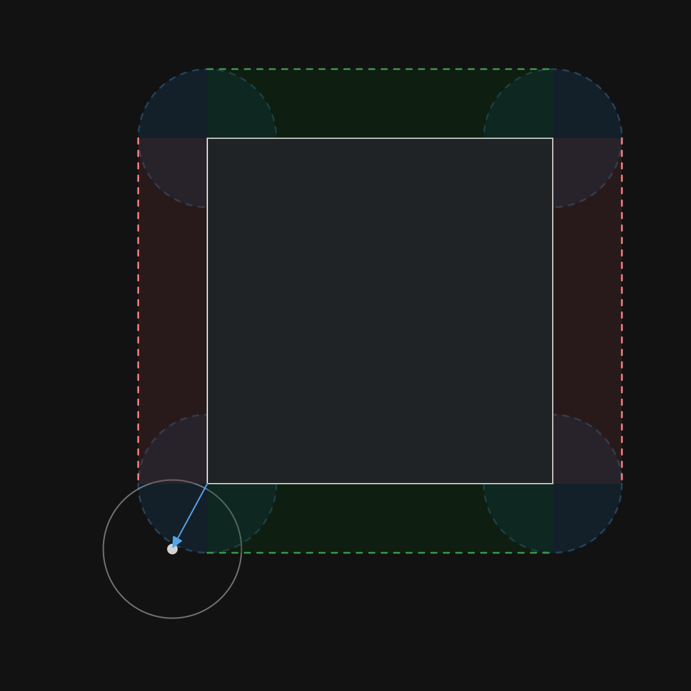
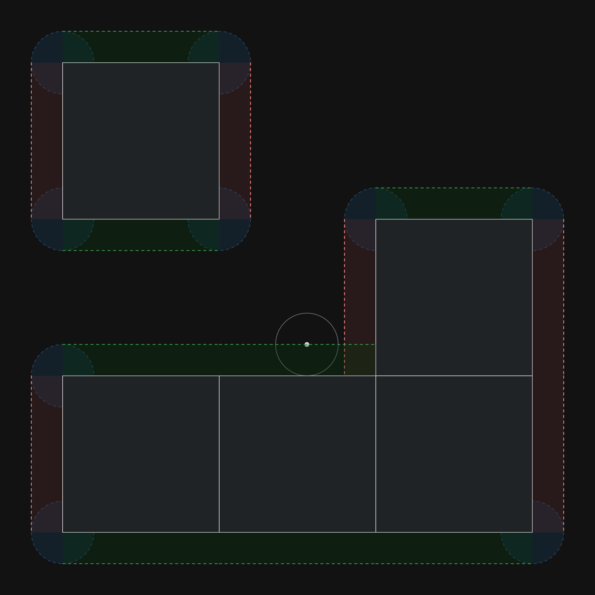
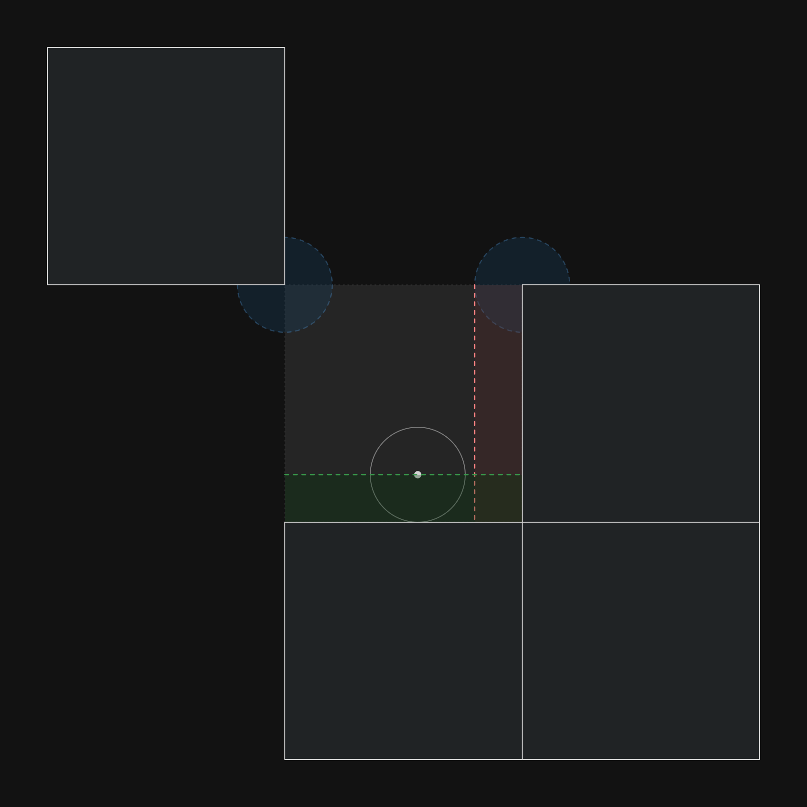

# 4 Collisions

> [Demo](./wolfenstein-3d.html)

So far I we have just been a ghost in the ~~machine~~ maze, just phasing through walls, here we change that.

## 4.1 Theory

### 4.1.1 Aim

What we are trying to do is to be able to collide with an object and ensure it does not pass through a solid wall.Note that physics is discete as we only upadate once per physics tick.

> 1. **A player moving towards a wall**


> 2. **The object moved too fast and is inside a wall**


> 3. **Correcting the object's position so that the overlap "never happened"**


### 4.1.2 Invariants

Given the type of game this is there are 3 invariants which can make our lives easier:

1. The player's collider is a circle
3. The world is made of square cells in a grid
2. The diameter of the circle is smaller than the width/height of a cell

### 4.1.3 Cases

There are 3 possible types of collisions to deal with:

> **1: Self Position**


The cell that the center of the circle belongs to will always be overlapping

> **2: Cardinal Neighbours**


If an edge (either horizontal or vertical) was crossed then collisions should be evaluated for said neighbouring tile

> **3: Diagonal Neighbours**


If the circle overlaps with the "closest vertex" then it has to account for the diagonal's collisions

## 4.2 Algorithm
### 4.2.1 Pseudocode

In order to find the penetration vector, we have to find how much overlap there is to the closest point on the surface. Luckily for us, part of the assumptions is that the player is a circle. We can then apply the vector to the position to move it out of the surface.

A penetration vector is calculated, the inverse of it is the offset to no longer have overlap



When applied to the side of a cell, it can be seen as a sort of barrier. Keep in mind that a circle is defined by a point, as such what we want to do is to move the point



This works on both axes.



But this does not work on the corners as here we see that a boundary still has room but will currently count as on the edge.



If we take the corners as circles instead then it works.



However, doing these calculations for each neighbour is too expensive.



So only do it for the edges + vertices that compose the current cell.




### 4.2.2 Code

The code uses a bitmap, here is the key for it.


```js
const calc_diag_pen_vec = (circle_x, circle_y, circle_r, vertex_x, vertex_y) => {
    const dx = circle_x - vertex_x;
    const dy = circle_y - vertex_y;

    const dist = Math.sqrt(dx * dx + dy * dy);

    const nx = dx / dist;
    const ny = dy / dist;

    const pen_diag_x = (circle_r - dist) * nx
    const pen_diag_y = (circle_r - dist) * ny
    return [pen_diag_x, pen_diag_y]
}

const calc_penetration_vector = (tilemap, player) => {
    const scale = tilemap.grid_scale;
    const w = tilemap.w;
    const h = tilemap.h;

    // Current Tile
    const tx = Math.floor(player.pos_x / scale);
    const ty = Math.floor(player.pos_y / scale);

    // Position within cell
    const rel_x = player.pos_x % scale;
    const rel_y = player.pos_y % scale;

    // Collider Radius
    const r = player.radius;

    // Collision mask
    let flag = 0b00000000;
    flag += 0b10000000 * (tilemap.buffer[bi_s(tx - 1, ty + 1, w, h)] != " ")
    flag += 0b01000000 * (tilemap.buffer[bi_s(tx/**/, ty + 1, w, h)] != " ")
    flag += 0b00100000 * (tilemap.buffer[bi_s(tx + 1, ty + 1, w, h)] != " ")
    flag += 0b00010000 * (tilemap.buffer[bi_s(tx + 1, ty/**/, w, h)] != " ")
    flag += 0b00001000 * (tilemap.buffer[bi_s(tx + 1, ty - 1, w, h)] != " ")
    flag += 0b00000100 * (tilemap.buffer[bi_s(tx/**/, ty - 1, w, h)] != " ")
    flag += 0b00000010 * (tilemap.buffer[bi_s(tx - 1, ty - 1, w, h)] != " ")
    flag += 0b00000001 * (tilemap.buffer[bi_s(tx - 1, ty/**/, w, h)] != " ")
    // console.log((flag >>> 0).toString(2))

    // Penetration Vector 
    let pen_x = 0;
    let pen_y = 0;

    // (flag & mask) == compare
    if ((flag & 0b11000001) == 0b10000000) {
        if (dist_sq(rel_x, rel_y, 0, scale) < r * r) { // top left
            [pen_x, pen_y] = calc_diag_pen_vec(rel_x, rel_y, r, 0, scale)
        }
    }
    if ((flag & 0b01110000) == 0b00100000) {
        if (dist_sq(rel_x, rel_y, scale, scale) < r * r) { // top right
            [pen_x, pen_y] = calc_diag_pen_vec(rel_x, rel_y, r, scale, scale)
        }
    }
    if ((flag & 0b00011100) == 0b00001000) {
        if (dist_sq(rel_x, rel_y, scale, 0) < r * r) { // bottom right
            [pen_x, pen_y] = calc_diag_pen_vec(rel_x, rel_y, r, scale, 0)
        }
    }
    if ((flag & 0b00000111) == 0b00000010) {
        if (dist_sq(rel_x, rel_y, 0, 0) < r * r) { // bottom left
            [pen_x, pen_y] = calc_diag_pen_vec(rel_x, rel_y, r, 0, 0)
        }
    }

    const scale_sub_r = scale - r; // cache for below
    // overwrite if needed (will always be an equal or "stronger" repulsion)
    if (flag & 0b01000000) {
        if (rel_y > scale_sub_r) pen_y = scale_sub_r - rel_y; // Up
    }
    if (flag & 0b00010000) {
        if (rel_x > scale_sub_r) pen_x = scale_sub_r - rel_x; // Right
    }
    if (flag & 0b00000100) {
        if (rel_y < r) pen_y = r - rel_y; // Down
    }
    if (flag & 0b00000001) {
        if (rel_x < r) pen_x = r - rel_x; // Left
    }

    return [pen_x, pen_y]
}
```