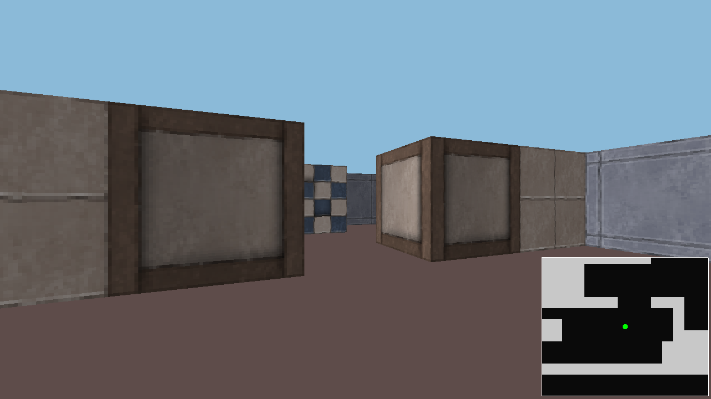

# 6 More Textures

> [Demo](./wolfenstein-3d.html)

NFGJSFGKNKSRNTGKNJSGRNKLRGNKLJSRGKJLRG

## 6.1 Generating More Textures

See [Chapter 3 - Rendering](./../3_rendering/README.md) for how to make textures.

## 6.2 Changing the Tilemap

Here is the new tilemap, lossely based on a very dusty map.

```js
            const tilemap = load_tilemap(`
#######################################################
#   %             ###     ####     ###              ###
#          %              ####                #     ###
#          #              ####  #########     #     ###
#   %      ###########    ####  ###############     ###
## ###$$$$$###########                                $
## ###################% %#####  #*************        $
## ##########             ####  #############*      ###
## ########## ########   %#     #############*      ###
#         #   ########    #     #############*      ###
#           ##########    #  ################*      ###
## ###################    #  ##########*******      ###
## ###################    #  ##########*  $$        ###
#    #             ###    #  ##########*            ###
#    #             ###    #  #############% %###    ###
#    #             ###                  *     *#    ###
#                  #####  ###########   *     *#    ###
#                  #####  ###########   **% %**########
#                                             #########
#                                             #########
#######################################################
                                    `)
```

With that we use a lookup table to search for the right texture.
```js
const TEX_WALL_STONE = await b64_to_img("...");
const TEX_WALL_DIRT = await b64_to_img("...");
const TEX_WALL_SAND = await b64_to_img("...");
const TEX_WALL_BATH = await b64_to_img("...");
const TEX_WALL_WOOD = await b64_to_img("...");

const TEX_LOOKUP = {
    '#': TEX_WALL_SAND,
    '*': TEX_WALL_STONE,
    '%': TEX_WALL_WOOD,
    '$': TEX_WALL_BATH
}
```

Which should look something like this:



> Note: I skipped some of the smaller changes but they are mostly around checking that there is not a tile rather than a `#`, while the rendering section I now lookup the texture. also some cahnges to the sky/floor colours.